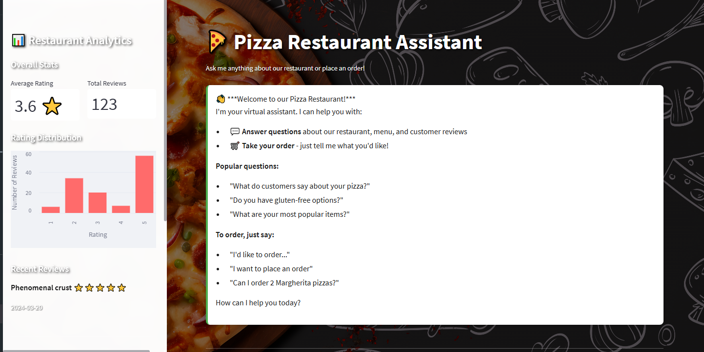
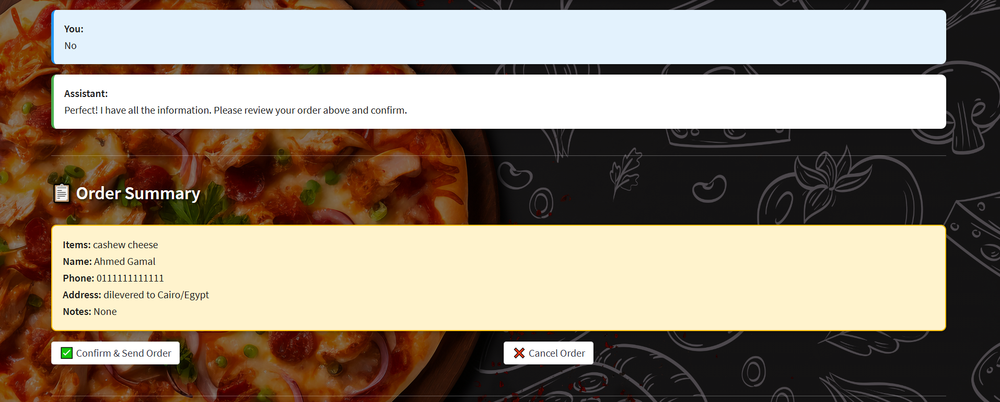
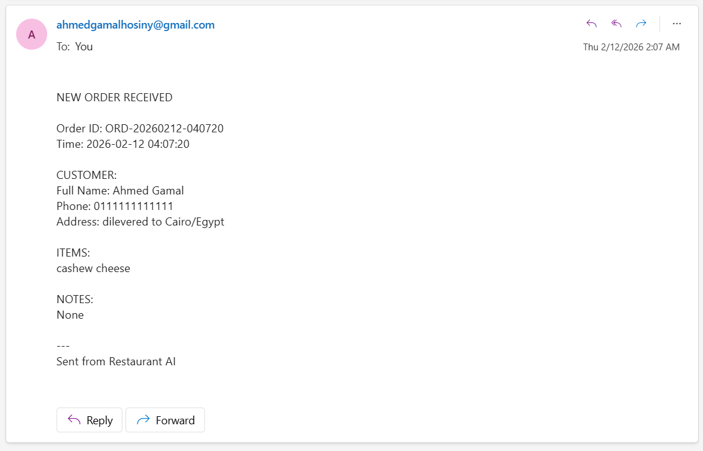

# 🍕 Pizza Restaurant Assistant

An AI-powered restaurant assistant that provides Q&A based on customer reviews and helps customers place orders.

## Features

### 💬 Q&A Mode

- **RAG-powered answers**: Ask questions about the restaurant and get intelligent responses based on real customer reviews
- **Context-aware**: Uses ChromaDB vector search to find relevant reviews
- **Natural conversation**: Powered by Ollama's Llama 3.2 model

### 🛒 Order Mode

- **Interactive ordering**: Guided conversation to collect order details
- **Email notifications**: Automatically sends order details to the restaurant
- **Order tracking**: Visual progress indicator showing what information has been collected

### 📊 Analytics Dashboard

- **Rating distribution**: Visual chart showing review ratings
- **Overall statistics**: Average rating and total reviews
- **Recent reviews**: Quick view of latest customer feedback

## Screenshots

### Q&A Mode Interface



### Order Mode Interface



### Analytics Dashboard



## Tech Stack

- **Framework**: Streamlit
- **LLM**: LangChain + Ollama (Llama 3.2)
- **Embeddings**: Ollama (mxbai-embed-large)
- **Vector Database**: ChromaDB
- **Data Handling**: Pandas
- **Visualizations**: Altair
- **Python**: 3.11+

## Setup

### Prerequisites

1. **Python 3.11+** installed
2. **Ollama** installed and running with models:
   - `llama3.2` - for chat responses
   - `mxbai-embed-large` - for embeddings

### Installation

1. Install dependencies:

```bash
# Using uv (recommended)
uv pip install -r requirements.txt

# Or using pip
pip install -r requirements.txt
```

2. Configure email settings (optional - for order functionality):

Create a `.env` file in the `src` directory:

```
SMTP_SERVER=smtp.gmail.com
SMTP_PORT=587
SENDER_EMAIL=your-email@gmail.com
SENDER_PASSWORD=your-app-password
RESTAURANT_EMAIL=restaurant@example.com
```

**Note**: For Gmail, you need to use an [App Password](https://support.google.com/accounts/answer/185833).

## Running the Application

### Using the batch file (Windows):

```bash
run_app.bat
```

### Using Streamlit directly:

```bash
cd src
streamlit run app.py
```

The application will open in your browser at `http://localhost:8501`

## Usage

### Q&A Mode

1. Click the **💬 Q&A Mode** button in the sidebar
2. Ask questions about the restaurant, such as:
   - "What do customers say about your pizza?"
   - "Do you have gluten-free options?"
   - "How's the service?"
   - "What's your most popular dish?"

### Order Mode

1. Click the **🛒 Order Mode** button in the sidebar
2. Follow the conversational prompts to provide:
   - Items you want to order (with quantities)
   - Your name
   - Phone number
   - Delivery address or "Pickup"
   - Special instructions (optional)
3. Review your order summary
4. Click **Confirm & Send Order** to submit

## Project Structure

```
Local_Agent/
├── src/
│   ├── app.py                          # Main Streamlit application
│   ├── main.py                         # CLI version (legacy)
│   ├── vector.py                       # Vector database setup
│   ├── order_tool.py                   # Order email functionality
│   ├── realistic_restaurant_reviews.csv # Review data
│   ├── chrome_langchain_db/            # ChromaDB storage
│   └── .env                            # Email configuration (create this)
├── requirements.txt                     # Python dependencies
├── pyproject.toml                       # Project metadata
├── run_app.bat                          # Windows run script
└── README.md                            # This file
```

## Features Breakdown

### Analytics Sidebar

- **Overall Statistics**: Average rating and total review count
- **Rating Distribution Chart**: Interactive bar chart showing review spread
- **Recent Reviews**: Latest 3 reviews with ratings and dates
- **Mode Switcher**: Easy toggle between Q&A and Order modes
- **Clear Chat**: Reset conversation and start fresh

### Chat Interface

- **Conversational UI**: Natural chat-like experience
- **Context Awareness**: Remembers conversation history
- **Visual Feedback**: Loading spinners and status indicators
- **Smart Detection**: Automatically suggests switching to Order mode when ordering intent is detected

### Order Management

- **Progress Tracking**: Visual indicators for order completion
- **Information Validation**: Ensures all required fields are collected
- **Order Summary**: Review before confirmation
- **Email Notifications**: Automated order delivery to restaurant

## Development

### CLI Version

The original CLI version is still available in `src/main.py`:

```bash
cd src
python main.py
```

### Data

Customer reviews are stored in `src/realistic_restaurant_reviews.csv` with columns:

- Title
- Date
- Rating (1-5)
- Review

## Troubleshooting

### Ollama Connection Issues

Make sure Ollama is running:

```bash
ollama serve
```

Pull required models if not already downloaded:

```bash
ollama pull llama3.2
ollama pull mxbai-embed-large
```

### Email Not Sending

1. Check `.env` file exists in `src/` directory
2. Verify email credentials are correct
3. For Gmail, ensure you're using an App Password, not your regular password
4. Check SMTP settings match your email provider

### ChromaDB Issues

If you encounter database errors, try deleting the `src/chrome_langchain_db/` directory and restarting the app. The database will be recreated automatically.

## License

This project is for demonstration purposes.
